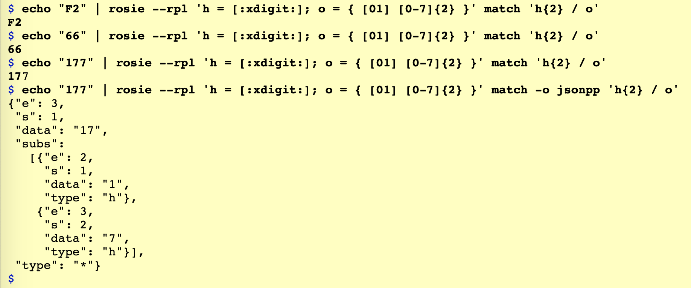
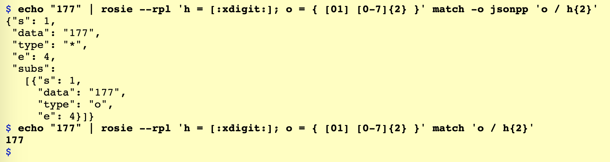
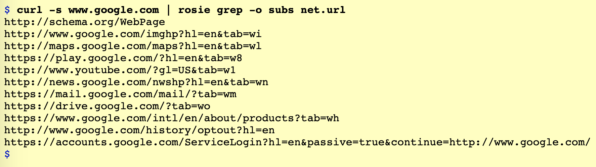
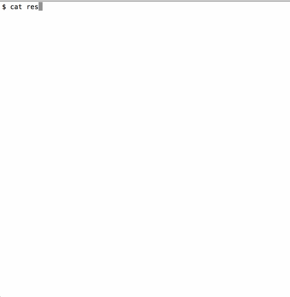
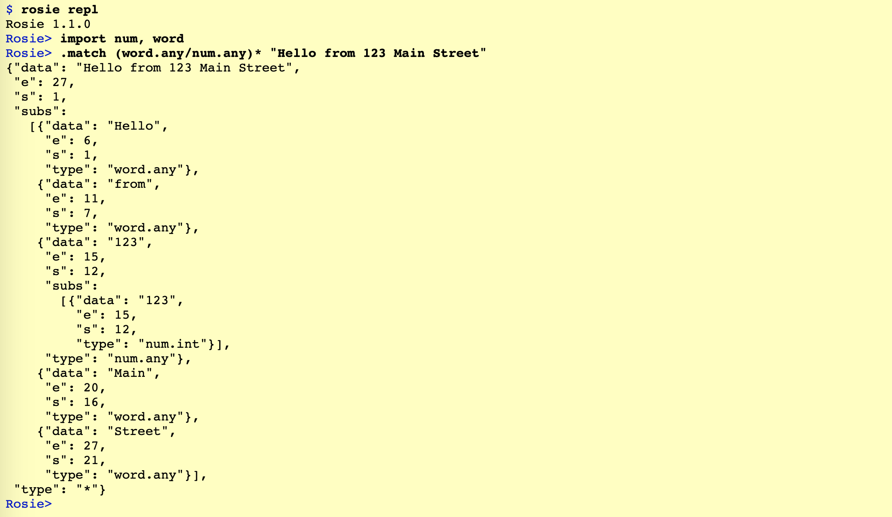

## At the command line

The Rosie project provides a CLI (like Unix `grep`) and a library, `librosie`,
that can be used within programs written in Python, Go, Haskell, C, and other
languages.  (See [Using Rosie from programs](Using Rosie from programs) below.)

Using RPL is like being able to name regex and reuse them to build larger expressions:

<table>
<tr><td><code> h = [:xdigit:] </code>        </td><td> declares <code>h</code> to match a hex digit </td></tr>
<tr><td><code> h+ </code>                    </td><td> matches a sequence of 1 or more hex digits </td></tr>
<tr><td><code> o = { [01] [0-7]{2} } </code> </td><td> declares <code>o</code> to match an octet </td></tr>
<tr><td><code> { h{2} o } </code>            </td><td> matches 2 hex digits then an octet, with no whitespace between them </td></tr>
<tr><td><code> h{2} o </code>                </td><td> will match 2 hex digits, whitespace, then an octet (no braces means match as separate tokens) </td></tr>
<tr><td><code> h{2} / o </code>               </td><td> will match 2 hex digits OR an octet </td></tr>
</table>

By default, Rosie will highlight matches in bold or in color:



In the screen capture above, the pattern `h{2} / o` matched only the first two characters of
the input "177".  The ability to output json (pretty-printed) helps us
understand why: the digits "17" are also hex digits!

RPL uses an _ordered choice_ operator (`/`) instead of the regex `|`, so `h{2}`
is attempted before `o`.  And RPL is _possessive_, so once `h{2}` matches, it is
never reconsidered.

Assuming we want "177" to match the octet pattern, we can simply reverse the
ordered choice:



The json output is nested like a parse tree, and contains a _type_ (the name of
the pattern that matched), the _data_ that matched, and _start_ (s) and _end_
(e) positions of the match.

Of course, no one wants to type `h = [:xdigit:]; o = { [01] [0-7]{2} }` on the
command line, so we'd typically save that into a file and let Rosie read
definitions from there.  

Rosie ships with a library of useful patterns, divided into namespaces.  The
pattern `net.url` matches the common URL format we see most often. (Another
pattern, `net.url_strict` matches a URL according to
[the spec](https://tools.ietf.org/html/rfc3986).) Here's `net.url` in action:



In that last screen capture, we used the output option `-o subs` to tell Rosie to
print only the sub-matches (similar to `grep -o`).

Below is a gif showing the `rosie match` command with the pattern `all.things`
(a choice among times and dates (in dozens of formats), network patterns,
identifiers, words, and numbers.  The default output format for `rosie match` is
`color`, and there is a customizable mapping from pattern types to colors.

<blockquote>
<table>
<tr>
Red: network; Red underlined: ipv6 specifically; Blue: date/time; Cyan:
identifier; Yellow: word
</tr>
<tr>
    <td></td>
</tr>
</table>
</blockquote>


## In the Rosie REPL

The Rosie command line program includes a REPL (Read-Eval-Print-Loop) that can
be useful for interactive pattern development and testing.  You can inspect
patterns, define patterns, and test them.



See the [REPL documentation](../../doc/repl.md) for more.


## From within programs

Starting with version 1.1.0, the interface libraries for `librosie` have their
own repositories in the
[clients group](https://gitlab.com/rosie-community/clients) of the Rosie
Community group on GitLab.  Roughly speaking, they support using Rosie in a way
similar to regex: you compile an expression and then use it for matching.

The following examples require the Rosie
[python module](https://gitlab.com/rosie-community/clients/python). 

Let's look at a short program that counts source lines of code in files, given
the comment start string on the command line, e.g. ```python sloc.py "#" *.py```.

```python 
# sloc.py
import sys, rosie
comment_start = sys.argv[1]

engine = rosie.engine()
source_line = engine.compile('!{[:space:]* "' + comment_start + '"/$}')

def count(f):
    count = 0
    for line in f:
        if line and source_line.match(line): count += 1
    return count

for f in sys.argv[2:]:
    label = f + ": " if f else ""
    print(label.ljust(36) + str(count(open(f, 'r'))).rjust(4) + " non-comment, non-blank lines")
``` 

The pattern `source_line` in the code above is defined as "not matching
optional-whitespace followed by either a comment or the end-of-line" -- in other
words, source lines.

Perhaps a more common usage of Rosie would be to leverage libraries of RPL
patterns, such as the ones that ship with Rosie.  The python code below searches
files for ipv4 addresses, and is invoked as, e.g. ```python ipv4.py test/resolv.conf```.

```python 
# ipv4.py
import sys, rosie

engine = rosie.engine()
engine.import_package('net')
ipv4 = engine.compile('net.ipv4')

for f in sys.argv[1:]:
    matches = ipv4.search(open(f, 'r').read())
    for m in matches:
        print(m)
``` 


